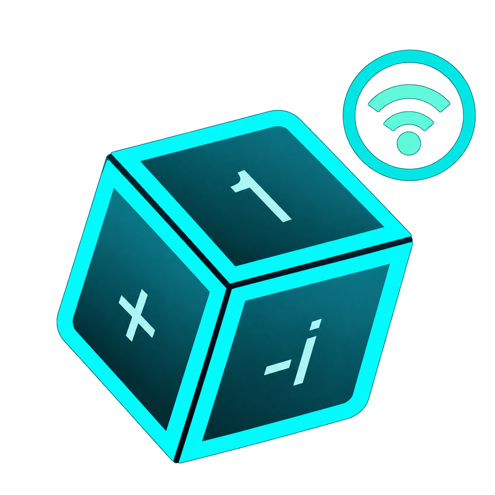

<p align="center">
  
</p>

# Суперпозиция (локальная версия)

**Суперпозиция (локально)** - это Android-клиент для игры с платой на ESP32. Плата управляет партией и считывает физические карты через NFC. Телефон показывает лобби и игровое поле, позволяет выбрать соперника и целевой кубит.

Проект использует игровые модели и отрисовку оригинальной игры «Суперпозиция», подключается к локальной плате по WebSocket.

## Содержание

- [Возможности](#возможности)
- [Как проходит партия](#как-проходит-партия)
- [Требования](#требования)
- [Подключение к плате](#подключение-к-плате)
- [Обмен сообщениями](#обмен-сообщениями)
- [Структура проекта](#структура-проекта)
- [Текущие ограничения](#текущие-ограничения)
- [Если что-то не работает](#если-что-то-не-работает)

## Возможности

- Подключение к плате по адресу.
- Лобби со списком игроков, подключённых к плате.
- Запуск партии для двух игроков.
- Отображение поля, текущего хода, задания, карт на поле и результата по сообщениям платы.
- Выбор целевого кубита нажатием на слот игрового поля.
- Команда сдачи и возврат в лобби после завершения партии.
- Игровые диалоги для просмотра карты, поворота кубита и сброса карт.

## Как проходит партия

1. Включите плату и подключите оба телефона к Wi-Fi платы.
2. Откройте приложение на устройстве. После подтверждения соединения появится локальное лобби.
3. Выберите второго игрока и подтвердите начало партии.
4. Во время своего хода нажмите на нужный слот. Клиент отправит плате команду выбора цели.
5. Приложите физическую карту к NFC-считывателю платы. После обработки хода плата отправит новое состояние, и поле обновится.

> [!WARNING]
> Карта, выбранная на экране телефона, пока не отправляется плате как игровой ход. Для розыгрыша карты нужен NFC-считыватель.

## Требования

| Компонент | Требование |
| --- | --- |
| Телефон | Android 5.0 (API 21) или новее, OpenGL ES 2.0 |
| Плата | WebSocket-сервером со статичным ip |
| Сеть | Подключение к Wi-Fi платы |
| Разработка | JDK 17 и Android SDK Platform 35 |
| Сборка | Gradle Wrapper 8.14.3, Android Gradle Plugin 8.9.3, Kotlin 2.2.21 |

> [!NOTE]
> Прошивка платы не входит в этот репозиторий. Для совместной работы она должна поддерживать сообщения, перечисленные ниже. См. [репозиторий с материалами платы](https://github.com/MrNightFury/QuantumGame).

## Подключение к плате

Адрес платы задан в [Network.kt](android/src/main/kotlin/io/github/winfeo/superpositiongame/android/data/source/socket/Network.kt). Клиент использует доступную сеть Wi-Fi для открытия WebSocket. Открытие сокета ещё не считается успешным подключением: приложение ждёт от платы событие `setId`.

Если `setId` не приходит в течение пяти секунд, появляется диалог ошибки с предложением проверить подключение к Wi-Fi платы. Имя сети приложение не проверяет, поэтому при подключении к другому Wi-Fi оно также дождётся тайм-аута.

## Обмен сообщениями

Сообщения WebSocket имеют поля `event` и `data`.

### Команды клиента

| Событие | Данные | Назначение |
| --- | --- | --- |
| `startGame` | `players` - ID двух игроков, `cubitCount` - `4` | Начать партию |
| `selectTarget` | `player` и `cubit` - индексы с нуля | Выбрать целевой кубит |
| `giveUp` | `null` | Сдаться |

Пример выбора цели:

```json
{"event":"selectTarget","data":{"player":0,"cubit":2}}
```

Команда `selectTarget` отправляется только во время хода текущего игрока.

### События платы

| Событие | Ожидаемые данные | Действие клиента |
| --- | --- | --- |
| `setId` | Числовой ID игрока | Подтверждает подключение |
| `setOnlineUsers` | Массив игроков с `id` и `name` | Обновляет список лобби |
| `addOnlineUser` | Игрок с `id` и `name` | Добавляет игрока в список |
| `removeOnlineUser` | ID игрока | Удаляет игрока из списка |
| `gameStarted` | Массив `players` | Открывает игровой экран |
| `setGameState` | Полное состояние партии | Обновляет игровое поле |
| `gameEnded` | `winnerId`, при наличии `winnerName` | Показывает результат |

> [!NOTE]
> Для `setGameState` клиент ожидает двух игроков, два регистра по четыре значения, целевой регистр и индекс текущего игрока. Дополнительно могут передаваться число сыгранных карт и карты на поле. Формат разбирается в [BoardMessageMappers.kt](android/src/main/kotlin/io/github/winfeo/superpositiongame/android/data/util/BoardMessageMappers.kt), затем преобразуется для отрисовки в [BoardGameStateMapper.kt](android/src/main/kotlin/io/github/winfeo/superpositiongame/android/data/util/BoardGameStateMapper.kt).

## Структура проекта

```text
android/
  src/main/kotlin/.../android/
    data/             WebSocket, преобразование сообщений, репозитории
    domain/           модели и сценарии лобби и партии
    ui/nav/           маршруты приложения
    ui/screen/lobby/  локальное лобби
    ui/screen/game/   игровой экран и панель игроков
    ui/dialog/        сетевые и игровые диалоги
    ui/theme/         тема приложения
  res/                строки, цвета, размеры и изображения
core/                 игровые модели, правила и отрисовка на libGDX
assets/               игровые ресурсы libGDX
```

Интерфейс Android написан на Jetpack Compose. Игровое поле отображается модулем `core` через libGDX. Доступ к плате проходит через репозитории и сценарии использования в слоях `data` и `domain`.

## Текущие ограничения

- Выбор карты на телефоне не реализован как команда платы. Карта разыгрывается через NFC-считыватель BoardGame.
- В используемом клиентом состоянии нет времени хода, поэтому таймер показывает `--:--`.
- Восстановление той же партии и ID игрока после потери соединения не гарантировано; для этого нужна поддержка прошивки.
- Адрес платы задан в коде. Если IP или порт изменятся, нужно обновить `BOARD_URL` в `Network.kt`.
- Клиент не проверяет SSID сети и определяет доступную сеть Wi-Fi средствами Android.

## Если что-то не работает

- **Через пять секунд появляется ошибка подключения.** Проверьте Wi-Fi BoardGame, адрес и порт платы, а также отправку события `setId` после открытия WebSocket.
- **В лобби нет второго игрока.** Убедитесь, что оба телефона подключены к одной плате и она отправляет `setOnlineUsers` либо `addOnlineUser`.
- **Поле не отображается.** Проверьте формат `setGameState`: нужны два игрока и два регистра по четыре кубита. Неизвестные значения кубитов не могут быть преобразованы для отрисовки.
- **Карта не разыгрывается с телефона.** Приложите её к NFC-считывателю платы.
